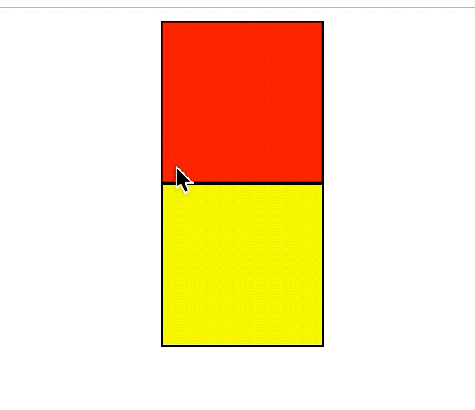

# vue-directive-draggable

通过 vue 指令的方式实现元素 drag 的功能，支持**移动端**和 PC 端。

- 安卓和桌面版使用 drag 和 drop 接口，ios 使用 touch 事件实现
  

## Install

```sh
$ npm run install vue-directive-draggable
```

## Features

- 拖拽源对象添加`dragging`属性
- 拖拽目标对象添加`drag-enter`属性

## Directive’s value.

`v-dragging = "value"`

### value 　

- Type: object
- Require: true

### value.list 　

- Type: array
- Require: true

### value.item

- Type: object
- Require: true

### value.item.key

- Type: string
- Require: true

### value.item.name

- Type: string
- Require: true

### value.item.followElmData

- Type: object
- Require: false

### value.item.followElmData.src

- Type: Image | string
- Require: false

### value.item.followElmData.width

- Type: object
- Require: false

### value.item.followElmData.height

- Type: object
- Require: false

example: value.item

```js

  {
    //必填
    key: '1',
    // 跟随鼠标元素的对象数据,可选，默认为元素本身
    followElmData:{
      src:'',
      width:'',
      height:''
    },
  },
```

## Event

监听方法：`vm.$dragging.$on()`

### dragStart 事件

### callback arguments

dragEventData

- Type:object  
  当前操作元素的数据

dragEventData.DDD

- Type:object  
  整个操作组的数据，包含 list,item

dragEventData.index

- Type:object

dragEventData.item

- Type:object  
  传入的 item 数据

dragEventData.el

- Type:Element  
  元素的 DOM 节点

### dragged 事件

### arguments

from

- Type:dragEventData  
  源对象数据

to

- Type:dragEventData
  目标对象数据

### dragend 事件

### arguments

from

- Type:dragEventData  
  源对象数据

to

- Type:dragEventData  
  目标对象数据

## Usage

```HTML
<!-- demo.vue -->
 <template>
     <div class="list">
       <div
         class="item"
         v-for="item in list"
         v-dragging="{ item: item, list: list, name: 'listName' }"
         :key="item.key"
         :class="{'drag-enter': item['drag-enter']}"
         :style="{'background-color':item.backgroundColor}"
       >
         <div v-show="item['drag-enter']" class="placeholder">
           拖拽目标对象添加`drag-enter`属性
         </div>
         <div v-show="item.dragging" class="placeholder">
           拖拽源对象添加`dragging`属性
         </div>
       </div>
     </div>
 </template>
 <script>

   import vueDragging from 'vue-directive-draggable';

   export default {
     directives: {
         vueDragging,
     },
     data() {
       return {
           list: [
             {
               key: '1',
               backgroundColor:"red"
             },
             {
               key: '2',
               backgroundColor:"yellow"
             },
           ]
       }
     },
     mounted() {
       this.$dragging.$on('dragStart', originDada => {
         console.log(originDada);
       });
       this.$dragging.$on('dragged', draggedDate => {
           console.log(draggedDate);
       });
       this.$dragging.$on('dragend', dragendData => {
         console.log(dragendData);

         //交换源对象与目标对象的背景颜色
         let toColor = dragendData.to.item.backgroundColor;
         let fromColor = dragendData.from.item.backgroundColor;
         dragendData.to.item.backgroundColor = fromColor;
         dragendData.from.item.backgroundColor = toColor;
       });
     }
 }
 </script>
 <style>
   .item {
    width: 100px;
    height: 100px;
    transition: transform 1s;
    border: 1px black solid;
    box-sizing: border-box;
    margin: 0 auto;

   }
   .drag-enter {
     transform: scale(1.2);
   }
   .placeholder {
     background-color: white;
     width: 100%;
     height: 100%;
   }
 </style>
```
